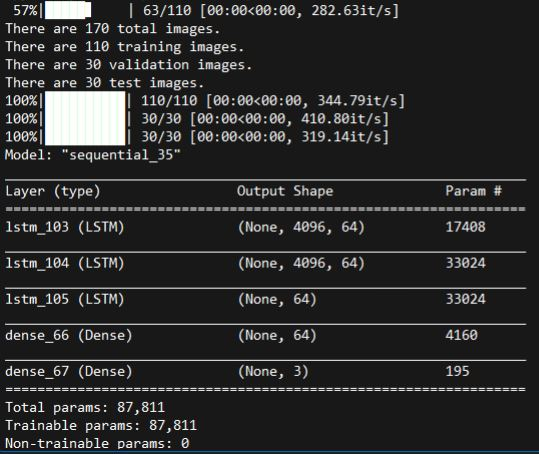
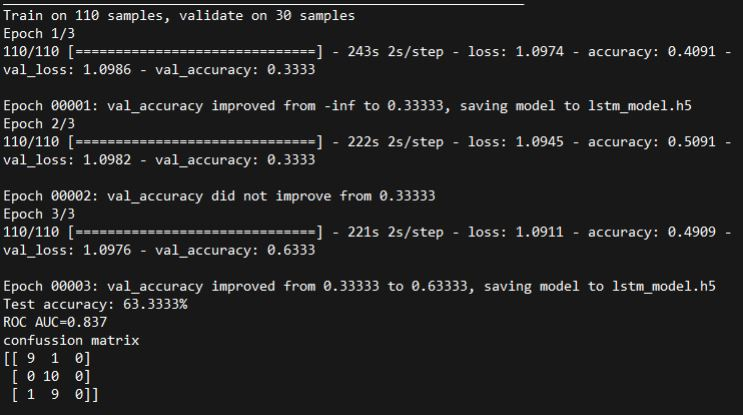

## Lstm Algorithm for Object Detection

Lstm algorithm for object detection between anchor, airplane and acordion photos.

Çapa, uçak ve akordeon fotoğrafları arasında nesne algılama için Lstm algoritması.

  

You can see the model.

Modeli görebilirsiniz.

  

I tried 15-20 times to get higher accuracy rate. 63% is the best I got.

Daha yüksek doğruluk oranı elde etmek için 15-20 kez denedim. %63, sahip olduğum en iyisi.
